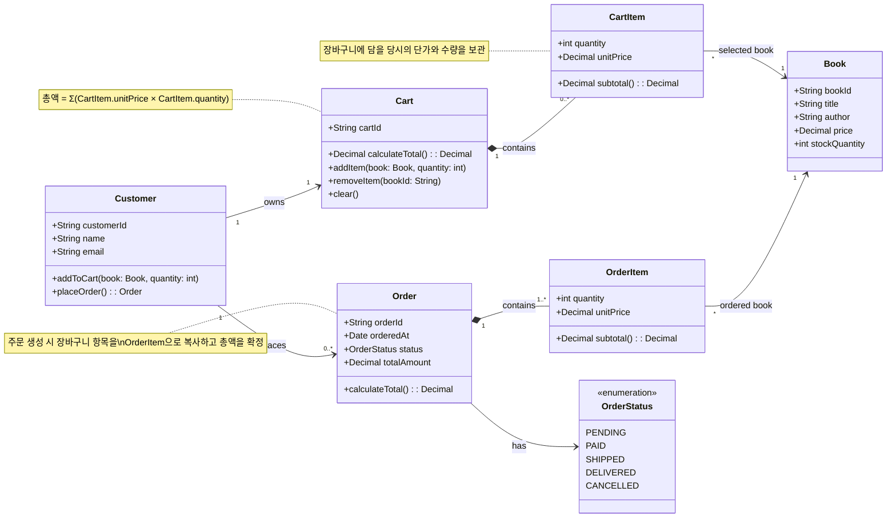

## 도메인(Domain)이란?

> [!note]
> * 영토, 영역, 소유지
> * 지식, 영향, 활동영역
> * 도메인 네임

## 소프트웨어 개발에서 도메인

> [!note]
> * 소프트웨어는 이를 사용하는 **사용자들의 활동이나 관심사**와 관련이 있다.
> * 사용자가 **프로그램, 또는 소프트웨어 서비스를 적용하는 주제 영역**을 도메인이라고 한다.
> * 소프트웨어가 **도메인을 반영**하도록 만들어야 한다. 
 
## 도메인 모델

> [!note]
> * 소프트웨어는 도메인의 **핵심 개념과 요소들을 통합하고, 그 관계를 정확하게 구현**해야한다.
> * 소프트웨어는 **도메인을 모델링**해야 한다.
> * 도메인은 현실 세계의 일부이고, 단순히 코드로 직접 옮길 수 없다. 
> 따라서, **도메인의 추상화인 도메인 모델**을 만들어야 한다.
> * 도메인 모델은 소프트웨어가 해결하려는 특정 문제 영역(도메인)의 핵심지도 
> * 도메인에 존재하는 **중요한 개념과 이들 사이의 관계, 그리고 규칙**을 표현
 

// 예시: 온라인 서점 운영

 
## 도메인 주도 설계(DDD)

> [!note]
> * 도메인의 **복잡성이 주는 문제를 해결**하기 위한 접근방법
> * **도메인 모델을 개발 과정의 중심**에 두는 방법이다.
> * 개발자 뿐 아니라 도메인을 가장 잘 아는 현업 전문가, 이해 관계자가 모두 참여해서 **함께 도메인 모델을 만들고 계속 발전시켜야** 한다.
> * **도메인 모델이 설계와 코드까지** 이어져야 한다 (모델 주도 설계)
> * 팀 안에서 **도메인 모델에 기반한 단일 어휘체계**를 만들고, 이를 문서, 회의, 대화, 그리고 코드까지 일관되게 사용한다 (보편 언어)

## 도메인 모델과 보편 언어를 프로젝트에 기록 

> [!note]
> * 용어사전.md
> * 도메인 모델.md 
> * 도메인 모델.drawio

---

## 도메인 모델 만들기

> [!note]
> * 듣고 배우기 (오랫동안 일했던 시니어나 전문가에게 배움)
> * **중요한 것**들 찾기 (개념 식별)
> * **연결 고리** 찾기 (관계 정의)
> * **것**들을 설명하기 (속성 및 기본 행위 명시)
> * 그려보기 (시각화)
> * 이야기하고 다듬기 (반복)

## 도메인 전문가가 없다면 (스타트업) 

> [!note]
> * 창업가, 기획자, PO 를 가상의 도메인 전문가로 활용
> * 다양한 탐색과 집단적인 학습 - 이벤트 스토밍 
> * 가설 기반의 점진적인 모델링 
> * 보편 언어의 의식적인 구축과 진화 (노력을 많이 해야함 - 기록 필수)
> * 베타 테스터, 초기 사용자와의 적극적인 소통
> * 도메인 모델의 발전과 진화, 공유를 더욱 적극적으로 해야 한다 
> * **경쟁 업체 서비스 분석** 

