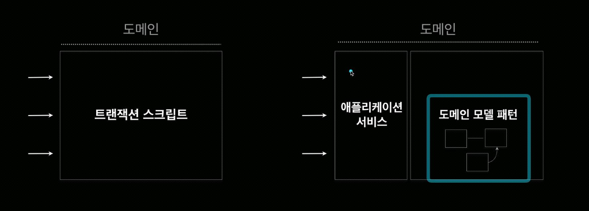

## 값 객체(Value Object)
> [!note]
> * 도메인 모델에서 식별자가 필요하지 않고 속성/값으로만 구별되는 오브젝트
> * 엔티티가 너무 많은 책임을 가지는 것을 방지하고  특정 속성 관련 행위를 분리해서 엔티티를 더 집중된 상태로 유지하게 한다.
> * 원시 타입보다는 도메인 개념을 더 명시적으로 나타내서 모델의 명확성을 높인다
> * 생성 이후에 상태가 변하지 않고 변경이 필요하면 새로운 객체로 교체한다
> * 풍부한 기능을 가진다 
> * 자체 유효성 검사도 가능하다
 
## 원시 타입을 객체로 교체 - 리팩터링
> [!note]
> * 원시 타입의 남용을 개선하고 코드의 **명시성과 안정성을 높이는** 리팩터링 방법
> * 값 객체는 도메인 모델의 핵싱 구성 요소로 값 그 자체의 의미를 담아내고 불변성, 동등성 등의 도메인 로직을 포함하여 설계하는 방식

## 도메인 모델 패턴의 두 가지 스타일
> [!note]
> * **단순 도메인 모델**
>  DB설계와 유사, 테이블에 대해 하나의 도메인 오브젝트
> * **풍성한 도메인 모델** 
> 상속, 전략, GoF 디자인 패턴, 연관 관계 
> 복잡한 로직에 적합하지만 DB매핑이 어려울 수 있다

## 도메인 로직의 API 개발
> [!note]
> * 도메인 모델 패턴은 트랜잭션 스크립트 처럼 작업 단위의 절차형 API 를 만들기가 어렵다
> * 도메인 로직의 명확한 **작업 단위 API** 를 제공하는 애플리케이션 서비스가 필요

